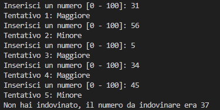
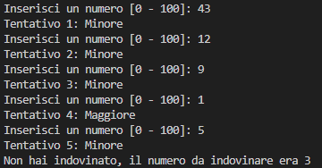
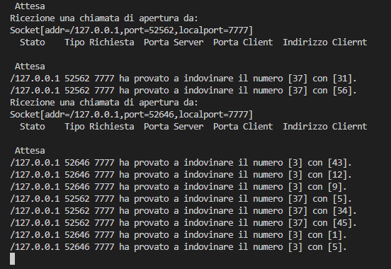

# Esercitazione-client-server

### Traccia dell'esercizio

Realizzazione il gioco dell'indovina numero in modalità client/server. 
Il server genera un numero casuale compreso tra 1 e 100, il client effettua massimo 5 tentativi per indovinare il numero generato dal server, per ogni tentativo il server risponde indicando se il numero da indovinare è più grande o più piccolo.
Se il numero viene indovinato viene visualizzato il messaggio "hai vinto in ..... tentativi", in caso contrario viene visualizzato il messaggio "Non hai indovinato, il numero da indovinare era ...." seguito dal numero generato dal server.
Il server può gestire più partite contemporaneamente.

Per ogni partita il server memorizza in un file di log in formato  XML la data e l'ora di inizio e fine partita,  il numero da indovinare, i tentativi effettuati e l'esito della partita

### Funzionamento

**Client 1**

**Client 2**

**Server**

